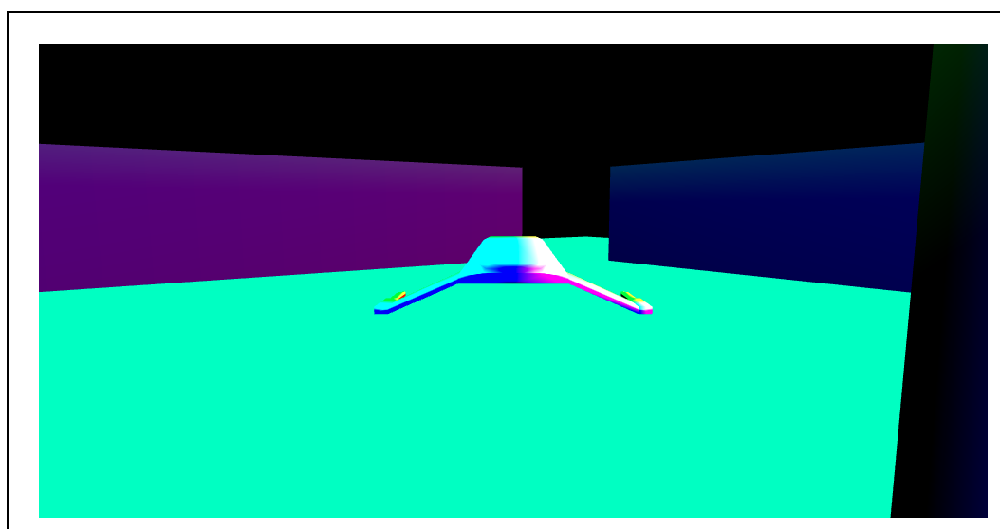
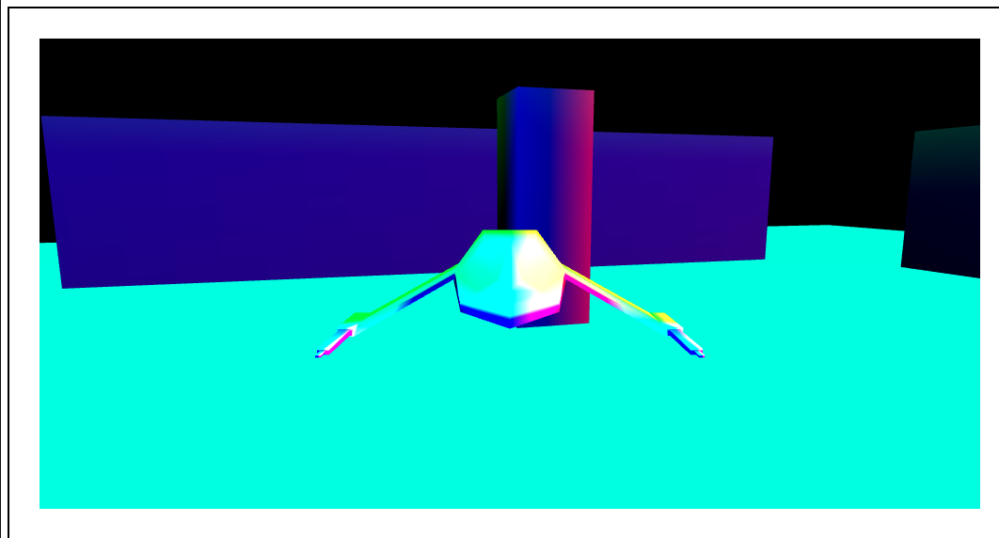

# WebGL-Pawn-Movement


For this activity, we have to add movement to the pawn, for it we mainly modify the scripts "Controller.razor.cs" and "Game.razor.cs". 

First inside "Controller.razor" we have added the tags "keyDownEvent", and "@keyUpEvent" to detect the keyboard keys.

```
@inherits LayoutComponentBase
<CascadingValue Value="this">
    <div tabindex=0 @ref="ctrlDiv" @onmousemove="mouseEvent" @onkeydown="keydownEvent" @onkeyup="keyupEvent">
        @Body
    </div>
</CascadingValue>
```

Inside "Controller.razor.cs" we have an interface with a method (GetMovement()) that returns a vector indicating the movement to a direction.

Besides we have the methods "keydownEvent()" and "keyupEvent()", the first one occurs when we press the key, and we make a calculation with the yaw angle to know which direction to move within the XZ plane and the second one is called when we stop pressing the key and sets to 0 all the impulses in XYZ.

-> keydownEvent() function:
```
        private void keydownEvent(KeyboardEventArgs e){
            Console.WriteLine("KeyDown");
            double f = System.Math.PI/180;                        
            double yaw = f*boomAngles.Yaw;
            switch(e.Key){
                case "w" :
                    MovementInput.x = -(float)System.Math.Sin(yaw);
                    MovementInput.z = -(float)System.Math.Cos(yaw);
                    MovementInput.y=0.0f;
                    MovementInput = this.ScaleMovement* MovementInput;
                    break;
                case "s":
                    MovementInput.x = (float)System.Math.Sin(yaw);
                    MovementInput.z = (float)System.Math.Cos(yaw);
                    MovementInput.y=0.0f;
                    MovementInput = this.ScaleMovement* MovementInput;
                    break;
                default:
                    break;
                    

            }
        }
```

-> keyupEvent() function:
```
        private void keyupEvent(KeyboardEventArgs e){
            Console.WriteLine("keyUp"); 
            MovementInput.x = 0.0f;
            MovementInput.y = 0.0f;
            MovementInput.z= 0.0f;
        }
```

Inside "Game.razor.cs" in the method "updatePawn()" we get the vector of the Controller thanks to "GetMovement()" which tells us the direction to which the Pawn wants to move, if the normal is greater than 0, we proceed to move the pawn and rotate it in that direction.

```
    private void updatePawn(){
        Vector3 displacement = this.PawnController.GetMovement(); // This displacement is pointing correctly in the world reference system 
        if(displacement.Norm()>0){
            this.LastDisplacementLocal=displacement; // Debugging purposes
            ActiveLevel.ActorCollection["apawn"].Transform.ForwardTo(displacement,this.Up);
            ActiveLevel.ActorCollection["apawn"].Transform.Translate(displacement);
            ActiveLevel.ActorCollection["apawn"].Transform.Scale(ActiveLevel.ActorCollection["apawn"].Scale);
        }
    }
```

### Screenshot of the Pawn:





### GIF of the Pawn Moving:


